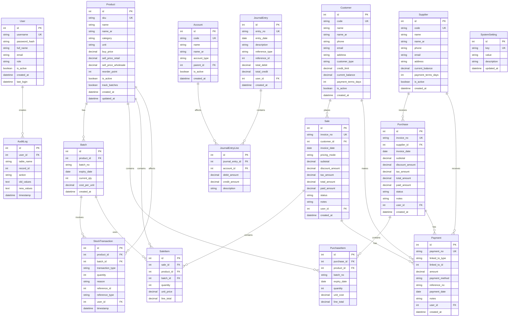

# GroceryStorePro - Database Entity Relationship Diagram

## Database Schema Design

### Core Entities and Relationships

## Key Relationships Explained

### 1. Product Management
- **Product** → **Batch**: One product can have multiple batches (1:N)
- **Batch** → **StockTransaction**: Each batch can have multiple stock movements (1:N)
- Products can be configured to track batches or not (track_batches flag)

### 2. Transaction Flow
- **Purchase** → **PurchaseItem**: One purchase can have multiple line items (1:N)
- **Sale** → **SaleItem**: One sale can have multiple line items (1:N)
- **SaleItem** → **Batch**: Each sale item references a specific batch for FIFO tracking

### 3. Financial Management
- **Payment**: Polymorphic relationship - can link to Purchase or Sale
- **JournalEntry**: Auto-generated for all financial transactions
- **Account**: Hierarchical chart of accounts structure

### 4. Audit and Security
- **User**: Role-based access control
- **AuditLog**: Tracks all critical data changes
- **SystemSetting**: Configurable system parameters

## Database Indexes

### Primary Indexes
- All primary keys (id fields)
- Unique constraints on business keys (sku, invoice_no, etc.)

### Performance Indexes
- product_id on Batch, StockTransaction, PurchaseItem, SaleItem
- customer_id on Sale
- supplier_id on Purchase
- invoice_date on Sale and Purchase
- timestamp on StockTransaction and AuditLog
- batch_id on SaleItem for FIFO queries

## Data Integrity Constraints

### Foreign Key Constraints
- All FK relationships enforced at database level
- Cascade deletes where appropriate (e.g., PurchaseItem when Purchase deleted)
- Restrict deletes for referenced entities (e.g., cannot delete Product with existing stock)

### Business Logic Constraints
- Stock quantities cannot go negative (configurable)
- Expiry dates must be future dates for new batches
- Payment amounts cannot exceed outstanding balances
- Journal entries must balance (total_debit = total_credit)

### Data Validation
- Email format validation
- Phone number format validation
- Positive values for prices and quantities
- Valid date ranges for transactions
